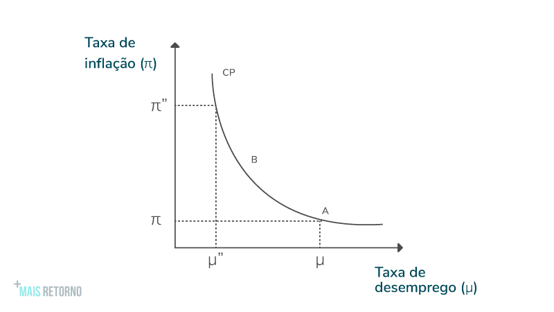
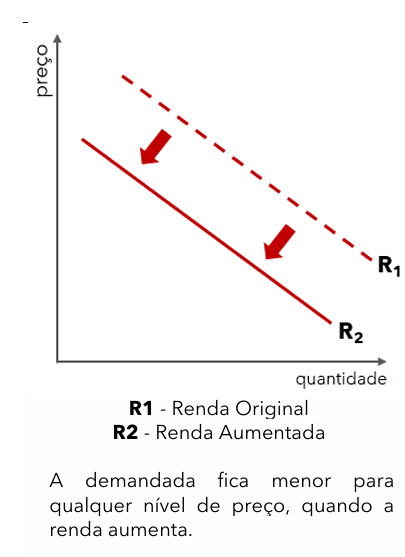
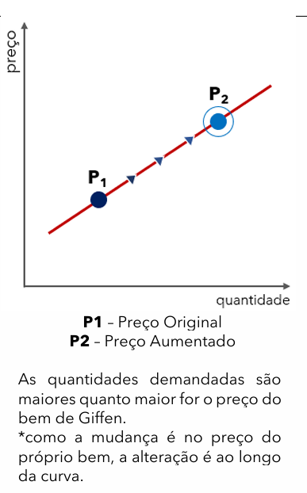
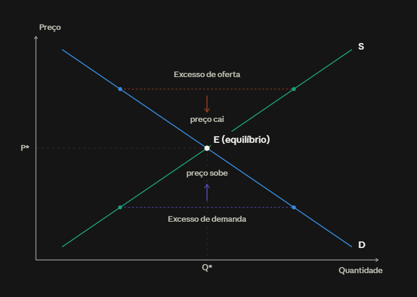

# Tradeoff entre Inflação e Desemprego

## 1. Aumento dos preços e diminuição do desemprego

Com baixo desemprego, existem dois estímulos para o aumento dos preços:

- Aumento do custo de produção (elevação dos salários e maior contratação de profissionais).
> Logo, aumento do repasse para a população.
- Aumento da demanda por produtos em razão do crescimento da renda dos trabalhadores.
> Logo, aumento da tentativa de lucratividade pelas empresas.

## 2. Reduzir a inflação tende a aumentar o desemprego

Para contextualizar, é importante entender a relação entre **taxa de juros e inflação**. Em geral, o aumento da taxa de juros leva a uma redução do consumo, o que tende a reduzir a inflação.

### Impacto do aumento dos juros

1. O aumento dos juros:
   - Eleva o custo dos empréstimos;
   - Estimula aplicações financeiras pelas pessoas;
   - Desestimula investimentos produtivos e em infraestrutura pelas empresas;
   - Reduz o consumo agregado da economia.

2. Com menor consumo, as empresas enfrentam redução na demanda e tendem a **diminuir os preços**.

3. Em suma, a redução do consumo leva à queda de preços:
   - Menor capacidade de repasse de preços aos consumidores;
   - Demissões para redução de custos;
   - Aumento da taxa de desemprego.

### Relação entre taxa de juros e política cambial

A taxa de juros também influencia o câmbio, contribuindo para a redução da inflação.

1. O aumento dos juros atrai investimento estrangeiro.
2. Com a entrada de dólares, o real se valoriza.
3. A valorização do real reduz o preço dos produtos importados:
   - Insumos e manufaturas utilizados pelas empresas;
   - Bens de consumo para a população.
4. A diminuição dos custos de importação gera:
   - Redução dos custos de produção;
   - Repasse dessa redução aos consumidores;
   - Queda do nível geral de preços.

---

# Emissão de Moeda e Inflação

A emissão excessiva de moeda tende a elevar os preços e gerar inflação.

**Causa:**

- Quando há aumento da quantidade de moeda na economia para a mesma quantidade de bens e serviços disponíveis, naturalmente ocorre uma pressão de alta sobre os preços.

---

# Curva de Phillips e Longo Prazo

- A Curva de Phillips representa o tradeoff entre inflação e desemprego.
- Possui inclinação negativa:
  - Eixo Y: taxa de inflação.
  - Eixo X: taxa de desemprego.
- O tradeoff não se sustenta no longo prazo.

## Curto prazo

- Como visto acima, um aumento dos preços leva à um estímulo da economia, tanto por parte das empresas (aumentam a produção e contratam mais p/ lucrar mais), quanto dos consumidores (aumentam a demanda por estarem recebendo mais), o que leva a uma redução do desemprego (economia aquecida).
- Só que essa relação, quando derivada da inflação, não se sustenta a longo prazo.
- É que a inflação não representa um estímulo por aumento da demanda dos produtos; é apenas um aumento do nível geral de preços. 
- Só os salários nominais aumentam: os salários reais diminuem. Ou seja, o poder de compra diminui.
- Do lado dos agentes econômicos, trabalhadores e empresas não percebem no curto prazo essa perda de poder de compra e real comportamento da demanda.

## Longo prazo

- Com o tempo, os agentes econômicos ajustam suas expectativas.
- Os salários são reajustados para compensar a inflação.
- A produção retorna ao seu nível normal.
- O resultado é apenas um nível geral de preços permanentemente mais elevado.

---

# Curva de demanda 

## Bens inferiores
- Aumenta a renda, demanda cai (deslocamento negativo - é o comportamento contrário). Ex. Miojo.
- É deslocamento da curva inteira.

## Bens de giffen 
- Aumenta o preço, aumenta a demanda (curva de demanda crescente). Quebra a lei da demanda. 
- É deslocamento na curva.

**Exemplo**
- Cesta de consumo de ovo e carne p/ uma situação de restrição orçamentária. 
- Cai o preço do ovo, diminui a demanda por ovo (relação crescente) e aumenta a de carne.
- O bem de giffen é o ovo nesse caso.

**Todo bem de giffen é um bem inferior**
- Note que caso aumente a renda da família, o consumo do ovo vai cair e a de carne vai aumentar ainda mais.
- Ou seja, o ovo é um bem de giffen e um bem inferior.

**Nem todo bem inferior é um bem de giffen**
- Para um bem ser de giffen é preciso cumprir condições muito específicas (como a do exemplo: poucos substitutos, ocupar fatia grande do orçamento, etc).
- Assim, aplicar a relação contrária de um bem inferior p/ um bem de giffen não é tão fácil.
- Por exemplo, para o miojo, p/ uma mesma renda, caso o preço diminua, a demanda provavelmente vai aumentar. Não é bem de giffen, dadas as mesmas condições que utilizamos antes.

--- 

# Ajuste de Preços

## Quando a oferta é maior que a demanda

**Oferta > Demanda**

- As empresas reduzem os preços para diminuir o excesso de estoque.
- Os consumidores passam a comprar mais.
- As empresas reduzem a produção.

**Resultado:**
- Quantidade demandada aumenta;
- Quantidade ofertada diminui;
- O mercado retorna ao equilíbrio (preços e quantidades).

## Quando a demanda é maior que a oferta

**Demanda > Oferta**

- Surge escassez de produtos.
- Aumento dos preços para elevar a lucratividade.
- Consumidores compram menos devido aos preços mais altos.
- Empresas aumentam a produção para aproveitar os maiores lucros.

**Resultado:**
- A demanda diminui;
- A oferta aumenta;
- O mercado retorna ao equilíbrio (preços e quantidades).

## Gráfico

- Esse ajuste de preços não se trata de deslocamento das curvas, apenas são movimentos ao longo das curvas.
> Deslocamentos são gerados por mudanças em fatores externos (renda, gosto, tecnologia, custo de insumos, impostos etc.)
- P/ um mesmo nível de preços, traçando uma reta sobre um nível mais alto de preços, temos uma situação de excesso de oferta.
- Fazendo o mesmo raciocínio, p/ um nível menor de preços, temos uma situação de excesso de demanda.
- A economia se organiza ao longo das curvas, até chegar a um ponto de equilíbrio em termos de preço e quantidade.
